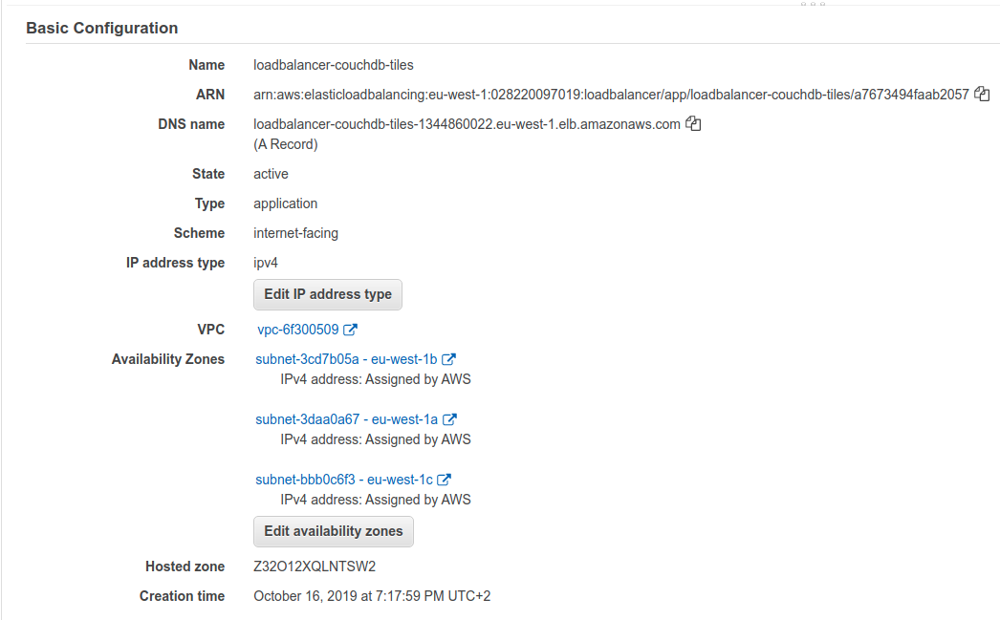
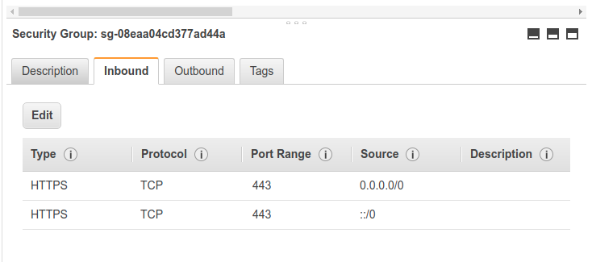
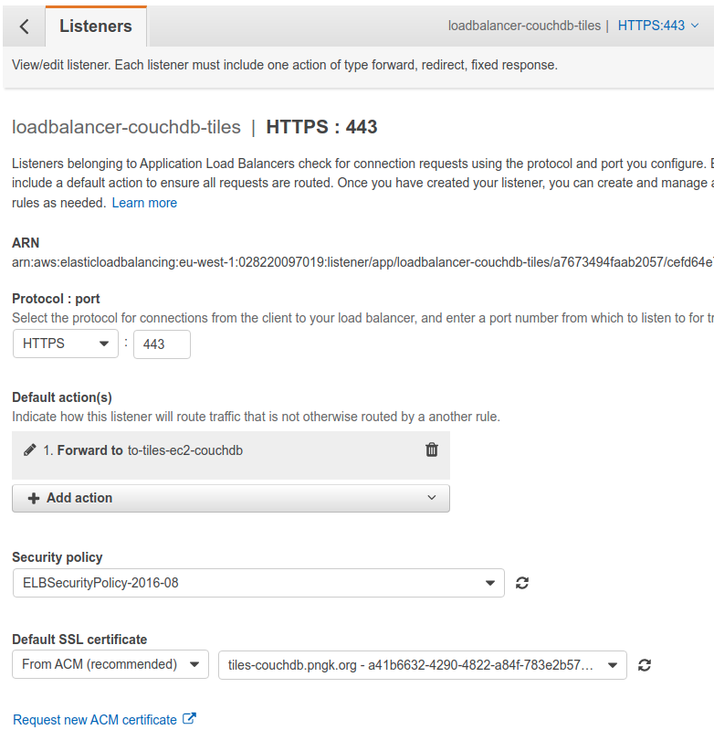
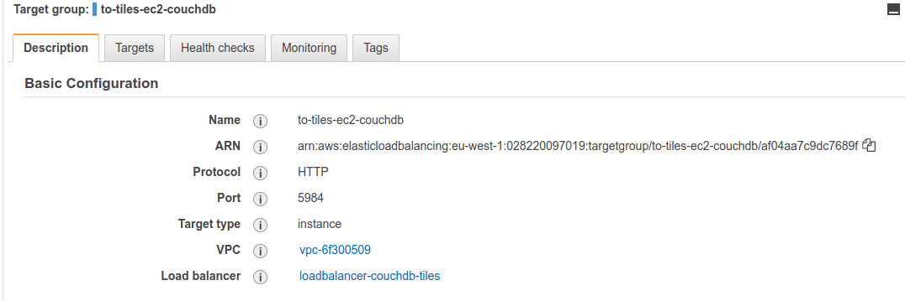
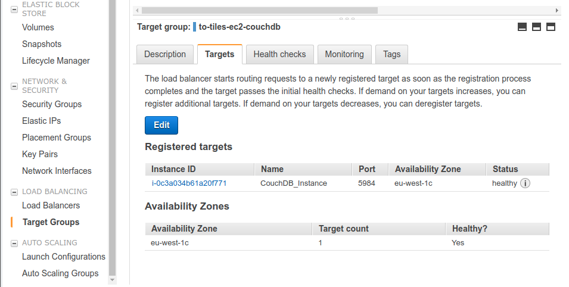
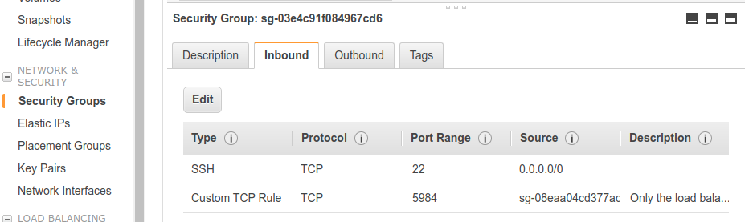
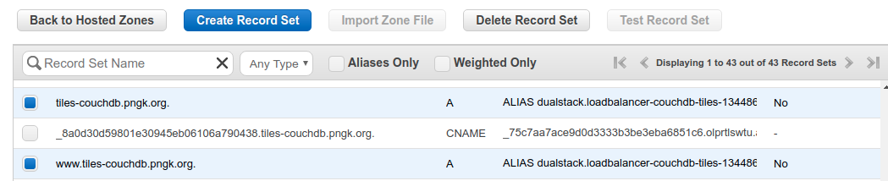

# Deployment of CouchDB

## Architecture

We have an ec2 instance (linux server) with docker installed. On that instance we install the [couchdb docker image](https://hub.docker.com/_/couchdb).

We use [aws load balancer](https://aws.amazon.com/elasticloadbalancing/) in front of the ec2 instance and create a DNS record set using [AWS Route 53](https://aws.amazon.com/elasticloadbalancing/)

## Setup instance

I'm using a micro ec2 instance, 1ram and 1cpu. Might not be big enough even for testing. But we will see.

We can connect to the server by entering this directory and using

`ssh -i couchdb.pem ec2-user@ec2-34-242-40-10.eu-west-1.compute.amazonaws.com`

or for eric
`ssh -o IdentitiesOnly=yes -i couchdb.pem ec2-user@ec2-34-242-40-107.eu-west-1.compute.amazonaws.com`

root_password = root

## Install Docker

Follow [this](https://docs.aws.amazon.com/AmazonECS/latest/developerguide/docker-basics.html) tutorial to ensure docker is working on the instance we can get our site showing hello world. Visit the site on the public ip

Get the latest version of docker couchdb `docker pull couchdb`

And run `docker run -p 5984:5894 -d -t -i couchdb` to start couchdb.
This is really dumb anyone can access it and change admin. We need admin to automatically be setup.

## Create a load balancer

The load balancer accepts traffic via https on port 443 and send it to port 5984 of the ec2 instance.

The load balencers security group only allows traffic on port 443

We listen on port 443 and forward to port 5984 on our instance (our target group)
_In order to allow the load balancer to listen on port 443 you'll need to get a certificate. I used [ACM](https://aws.amazon.com/certificate-manager/) to get the certificate._

In the default actions above you see ware are forwarding traffic to a target group which is defined below. We communicate with the instance on port 5984.

The target is our instance, defined on the Targets tab.

We can now change the security group of the EC2 instance so it allows SSH access and only access from our load balencer on port 5984

## Setup a DNS record

To access the site on HTTPS we need to create a domain, we've chosen https://tiles-couchdb.pngk.org/. Create an A record with an ALIAS target as the load balencer that was created above.

When you have the certificate created be sure to select for the CNAME to be automatically created.

## Couch DB

Upon accessing the `/_utils` the first time run the checks. If the checks fail you need to follow [this](https://stackoverflow.com/questions/54334950/when-attempting-to-verify-my-couchdb-installation-i-get-the-error-error-could) use `0.0.0.0` be sure to configure a node and give it a username `admin` and password `admin`
