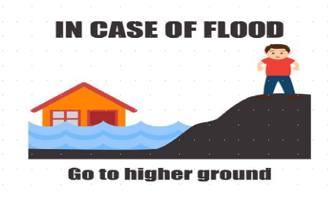

## Saka viya kəsi diya! Ndji ata wul! Nga nga dia! Ndji ata vi na ɓɗaku ka ngakur!

### MƏ IMI KƏ ƁƏLƁƏLASI ATA VƏI Mwari asə vəi na ɗəɗəgəl

1. Kədzi maɗankyar avəiya sakatə imi akwa tər!

2. Girade zhar maɗankyar kada gyal ata vi natə imi ɓla ata wa!

3. Kagir jigatə mjir kuta ki giri saka ka saka!

4. Kagir wul ka kəcikəcikur ɓɗakəlaka kammya nkamta silkə!

5. Girade sa imir kufa wa. Aa tsoktə səntə ngwokur!

6. Vəsə hankal diya! Imiyir kufa ana duwa suwayer na tsəltsəlari apa glas ka liya natə aa digəi mda!

7. Girade kətə suwayer natə giraɗi səndə kəra wa ata vəi pərtu wa! Suwayer ni aa tsoktə digəi mda!

8. Girade fəlthlə kəra gada nakwa kuta pərtu wa! Kagir zha lukwa kuta imiyir pərtu ka kuta kufa!

9. Zhar gir vəi mə mda pla alagir kagir zha vəi.

10. Nka ləha sakatə mdə pla alagir vəi ni ɓɗaku ka ngakur!
