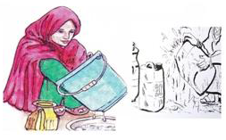
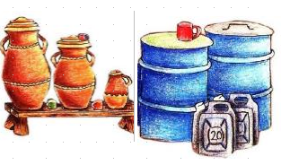
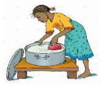
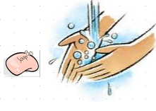

## Steps for keeping water safe

#### **Step 1**: **WASH** your container before fetching water. Dirty containers will contaminate your water for drinking

#### **Step 2**: Use containers with lids/covers for fetching water

#### **Step 3**: Store water in clean covered containers to avoid contamination by flies and dust

#### **Step 4**: Avoid dipping your hand inside the water use a clean water dipper

#### **Step 5**: **WASH** your hands with soap and Water to prevent transfer of germ- causing illnesses

