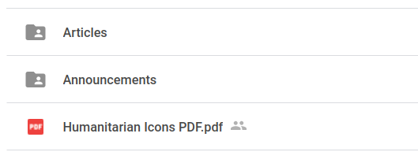
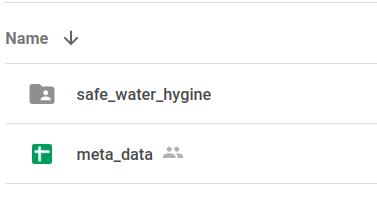
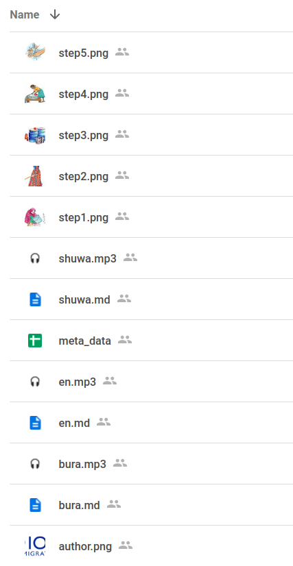
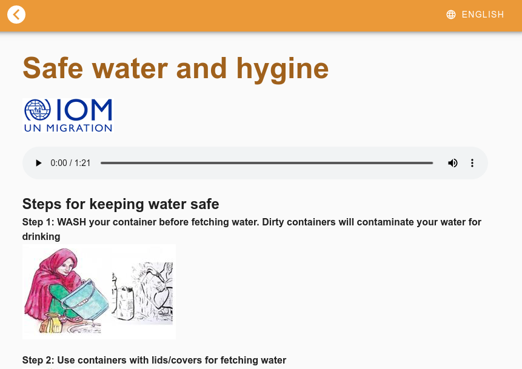
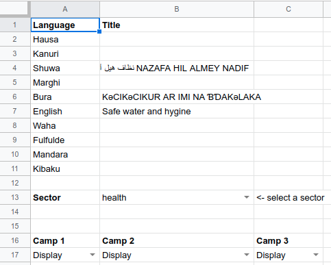
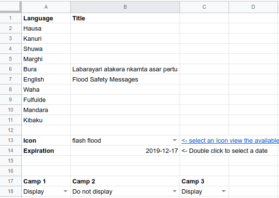
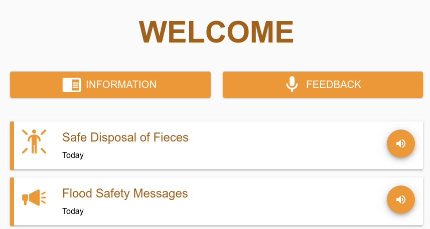
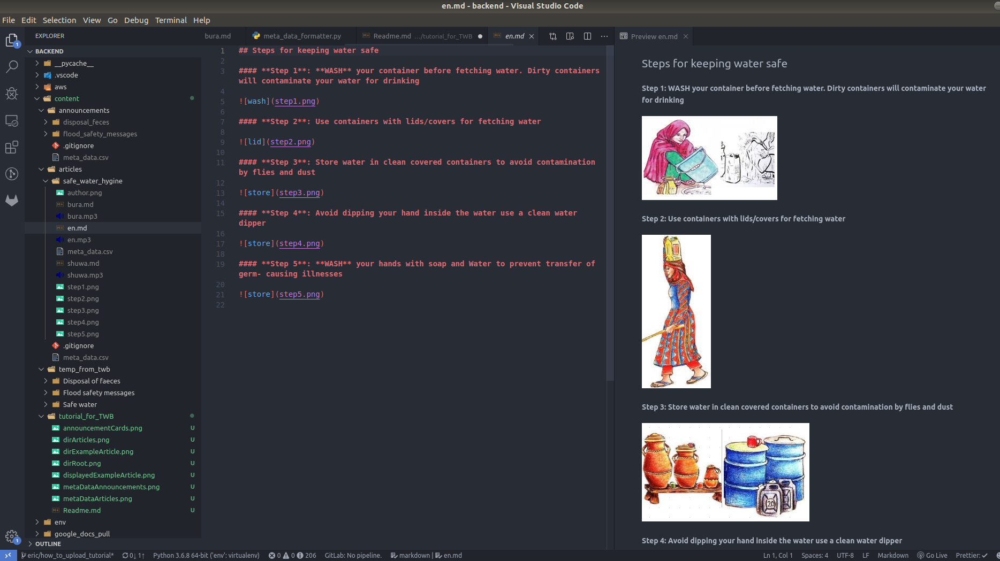

# How to add content to IIAB

## Intro

We need a temporary solution for uploading content to the IIAB platform before we have the backend admin user interface created. We have decided to use google drive to manage this temporary content management system, which is accessable [here](https://drive.google.com/drive/folders/1wYpUXa5ImbUBa8M35Xwa-dT-F0N458Wj?usp=sharing).

#### Requirements

- Basic knowledge of google drive e.g. create folders, add documents, use google sheets.
- Ability to write [Markdown](https://en.wikipedia.org/wiki/Markdown) documents.

## Folder structure

Upon entering the google drive directory you will see two folders and a PDF of Icon options which are utilized for the announcements.

From here you can add **Announcements** i.e. the content which is displayed on the welcome screen, or **Articles** the content which is categorized by sector and displayed on the Information screen.

The basic structure of both of these folders is the same, the meta data (we will explain this concept later) differs. We will use an article for this example.

If you enter the **Articles** directory you will see a list of folders (here we are only showing one article _safe_water_hygine_) which contain each of the individual articles to be displayed on TILES.

The `meta_data` sheet should remain in this directory. Each time a new articles is created it should be copied.

If we enter the _safe_water_hygine_ directory we see the following structure.

Let's break this apart we can group the files shown here into 5 different groups.

### 1) Image files for the Markdown content

These are the photos which are referenced as images in the markdown (e.g. step5.png, step4.png, step3.png, step2.png, step1.png), for example in the the markdown files here we reference step1.png as shown below.

``

The image types allowed for our markdown files are **.png** and **.jpg**

### 2) Author Image

We agreed to display the logo of the organization who created the content. For now only one author image file will be displayed. Upload the logo and be sure it is called `author.png` if it is named differently or misspelled it will not be uploaded. Keep in mind the size and shape of the file, should take up no more than 50kb of data.

The logo will always appear in the location shown below (showing the IOM logo) underneath the article title and above the location to play the audio files. If no file titled `author.png` is present in the article directory then no image will be displayed.

### 3) .mp3 audio files

If an audio file is present then our users will be given the option to play it, if no audio file is present (in a given language) then the user will obviously not be able to play an audio file for that language. The audio files must be saved as .mp3 files and the language options are shown below. The file must be spelled correctly, for example if you save a Kibaku audio file as `kibbaku.mp3` instead of `kibaku.mp3` then then user will not be able to listen to the Kibaku audio.

**Language options**:

- English = `en.mp3`
- Waha = `waha.mp3`
- Kibaku = `kibaku.mp3`
- Fulfulde = `fulfulde.mp3`
- Mandara = `mandara.mp3`
- Bura = `bura.mp3`
- Marghi = `marghi.mp3`
- Shuwa = `shuwa.mp3`
- Kanuri = `kanuri.mp3`
- Hausa = `hausa.mp3`

### 4) .md Markdown files

The markdown files are used to create the content of the articles and announcements, they will be rendered underneath the option to play the audio.

Uploading markdown files is basically the same as the .mp3 files. They must be labeled in the format shown below or they will not be able to be rendered.

**Language options**:

- English = `en.md`
- Waha = `waha.md`
- Kibaku = `kibaku.md`
- Fulfulde = `fulfulde.md`
- Mandara = `mandara.md`
- Bura = `bura.md`
- Marghi = `marghi.md`
- Shuwa = `shuwa.md`
- Kanuri = `kanuri.md`
- Hausa = `hausa.md`

_NOTE: for Shuwa, Virgina told us it would be ok to have the text side by side. i.e. Latin text followed by the Arabic text see example in_ `articles/safe_water_hygine/shuwa.md`

### 5) Meta data

The meta data sheet must be included in every directory. This sheet contains important information for the Articles and Announcements.

In both sheets you have the option to select which camps the article or content will be displayed. By default the content is displayed in all camps, if you like to have it not displayed in a certain camp then select `Do not display` for that camp.

We will now explain how the Articles meta data sheet is structured, then discuss the differences in the Announcements meta data file.

#### 5a) Articles

In cells B2-11 you should include the title of the article in the given language.

_NOTE: The article will only be displayed to the user if both the title and it's markdown file are provided. For example if I provide an `en.md` file but leave the english title - in the metadata sheet - blank, then the english version of the article will not be displayed._

In cell B13 you can select the sector this article belongs in. If this is left blank the article will not be displayed.

#### 5b) Announcements

The Announcements meta data is very similar to the Articles, in the sense that you must provide a title for the Announcement - in the given language - to be displayed.

The additional information to provide for an Announcement is the Icon which will be displayed next to the title of the announcement on the welcome page (shown below), along with the expiration data. When the expiration date is reached the announcement will be removed from the platform.

## Proposed workflow

Of course work in whatever way you feel comfortable, but we propose the following steps.

1. Create a directory on your local machine (i find it a bit easier to work locally then on google drive)
2. Use some markdown editor to create the markdown files. I prefer [VSCode](https://code.visualstudio.com/), but there are dozens of suitable programs out there. Below is an image of my screen when editing a markdown file.

3. Add the images the markdown file requires to the directory
4. Add the logo of the author and be sure it's saved as `author.png`
5. Add the .mp3 files for all of the audio. Be sure they are named properly!
6. Go to the base of the relevant google drive directory (e.g. [Articles](https://drive.google.com/open?id=1NqlV3akLjEmbeniKg4_GcmwzXKM_QG9P)) and drag the folder from your local directory to that directory

7. Make a copy of the meta_data sheet and put that sheet into the newly added folder.

8. Rename that sheet from `Copy of meta_data` to `meta_data`. This step is very important, if it is misspelled then the meta data will not be uploaded.

Repeat this process for as much content as should be added, then let PNGK know and we will update the database. When the tablets reconnect to the internet the content will be uploaded to them.
