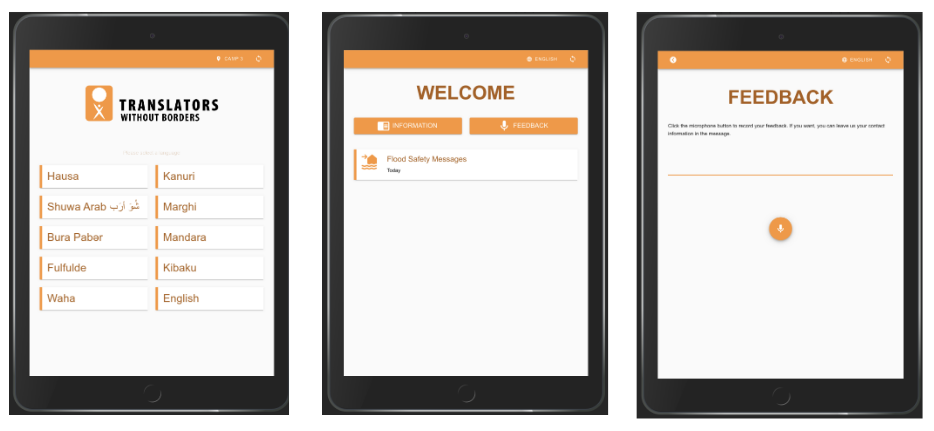

# Home

## TILES

_Providing feedback and receiving information in any language anywhere._

## Intro

The purpose of this page is to give a quick overview of TILES. TILES is a content management system designed to operate in austere environments and to accommodate any language.

_Figure 1: Overview of TILES._

&nbsp;

## **Why** we need TILES

In refugee camp settings disseminating information can be challenging. Existing software systems are not compatible with many languages spoken in camps. They typically also only work when the user is connected to the WiFi network of the system.

Currently, there is no such user-friendly information dissemination and feedback system.

&nbsp;

$ \sum_{\forall i}{x_i^{2}} $

## **What** is TILES

With TILES users can access information and provide feedback offline, from any location. The entire user interaction takes place in their language.

A user can set up the system by connecting to a TILES WiFi hotspot and opening the TILES webpage. The website automatically downloads to the browser so the user can interact with it offline.

#### Feedback mechanism

TILES allows people to provide verbal feedback in their own language. The steps below are illustrated in \ref{Figure2}.

1. A user can leave verbal feedback from any location. Feedback is recorded anonymously, but users can leave their contact information if they wish to do so.
2. When the user connects to the WiFi and opens the webpage the data is securely sent to a server located in the camp.
3. When camp managers connect to the TILES hotspot, they can login to a secure admin interface and listen to the feedback.
4. Feedback is automatically1 transferred from the server at the campsite to the cloud.
5. Authorized people located elsewhere can access the feedback left in the camp through the cloud server.

_Figure 2: Overview of the TILES feedback mechanism._

#### Information dissemination

TILES can provide textual, pictorial, audio and video content in any language. The steps below are illustrated in _Figure 3_.

1. Authorized people can remotely add or remove content from TILES through the cloud server.
2. The cloud server sends the content to the server located in the camp.
3. Camp managers can add content directly to the server in the camp.
4. The user is updated with new content when he/she is on the _TILES Website_ and within range of the WiFi hotspot.
5. The user can visit the website and access the content from any location.

_Figure 3: Overview of the TILES information dissemination system._

&nbsp;

## **How** TILES works

TILES consists of three main components:

1. The _TILES Website_ which users interact with.
2. The _Remote TILES Server_, a physical device that broadcasts WiFi and keeps the _TILES Website_ up-to-date.
3. The _Cloud TILES Server_ which allows people offsite to interact with the system.

### 1. TILES Website

Users receive information from TILES by reading or listening to content. Verbal feedback can be recorded directly in the users web browser. Illiterate people can therefore also interact with TILES.

_Figure 4: Screenshots of the TILES Website._

### 2. Remote TILES Server

The _Remote TILES Server_ provides a wireless hotspot in the camp. It is running on the piece of hardware shown in _Figure 5_ and is located within the camp. The _Remote TILES Server_ gives users access to the _TILES Website_ and its local database is synchronized with the database on the _Cloud TILES Server_.

_Figure 5: The Remote TILES Server icon and the proposed hardware, [BRCK](https://www.brck.com/enterprise/)._

**Features of the Remote TILES Server**

1. It is durable and can therefore be transported by vehicle and by hand.
2. It can withstand power surges and outages.
3. It has a WiFi hotspot allowing users to access the _TILES Website_.
4. Camp managers can access an admin interface onsite to add content and listen to feedback.

### 3. Cloud TILES Server

The Cloud TILES Server allows authorized people to interact with TILES remotely.

_Figure 6: The Cloud TILES Server icon._

**Features of the Cloud TILES Server**

1. Information sent to the system is encrypted.
2. It interacts with all of the _Remote TILES Servers_ which are deployed.
3. It has a user-friendly interface for authorized people to access TILES.

&nbsp;

1 If the camp is located in a place where internet is available via the GSM or satellite network. If there is no internet available then data will have to be transferred through another computer, e.g. an admin in the camp logs onto TILES and all data is downloaded to their computer, when they leave the camp and enter a location with internet access the data is then sent to the _Cloud TILES Server_.

&nbsp;
